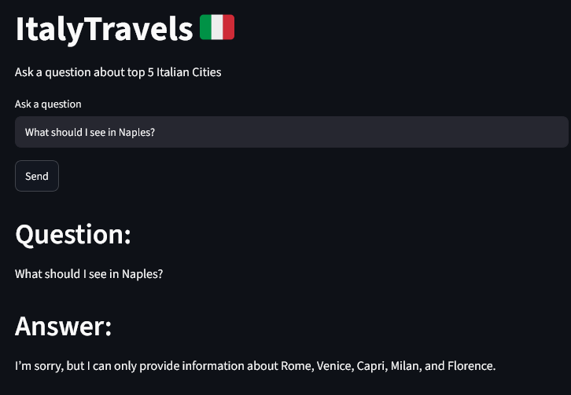
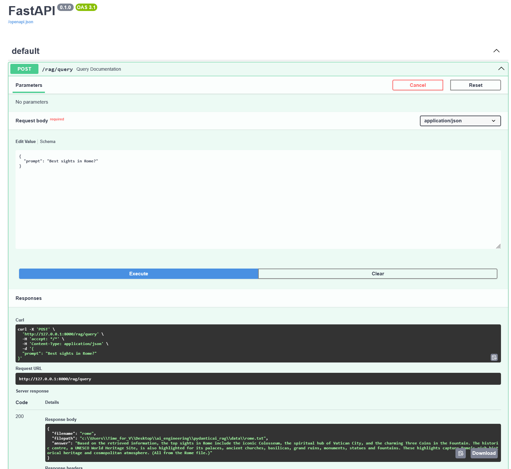

# ItalyTravels 🇮🇹

A Retrieval-Augmented Generation (RAG) application that answers travel and information questions about Italy's top 5 tourist cities: **Rome, Venice, Capri, Milan, and Florence**. Built as a Student project to explore an agentic RAG pipeline that retrieves relevant documents from a database and returns structured, validated responses.

## Tech Stack

- **[PydanticAI](https://ai.pydantic.dev/)** — agent framework with structured output validation
- **[FastAPI](https://fastapi.tiangolo.com/)** — backend API serving the RAG agent
- **[LanceDB](https://lancedb.com/)** — vector database for document retrieval
- **[Streamlit](https://streamlit.io/)** — frontend user interface
- **[Groq](https://groq.com/)** — LLM inference (using `openai/gpt-oss-20b`)

## Architecture & GenAI Techniques

The app has three clean layers: **Streamlit** (UI) → **FastAPI** (API) → **PydanticAI agent** (GenAI logic).

The agent combines:
- **Prompt Engineering** — a role-based system prompt enforcing grounding and anti-hallucination
- **RAG** — WikiTravel city content is embedded in **LanceDB** and retrieved per query
- **Tool Calling** — the agent decides autonomously when to call the `retrieve_top_documents` tool
- **Structured Output** — responses are validated against a Pydantic schema (`RagResponse`)

## How It Works

1. Information about each city (sourced as text from WikiTravel) is embedded and stored in LanceDB.
2. The user asks a relevant question through the Streamlit interface.
3. The question is sent to a FastAPI endpoint, which passes it to a PydanticAI agent.
4. The agent uses a retrieval tool to search LanceDB for the most relevant text document.
5. The agent generates a grounded, structured response (`answer`, `filename`, `filepath`) — citing its source and following instructions to avoid hallucination.
6. Streamlit displays the answer, source, and a matching city image.

## Setup

**1. Clone the repository and install dependencies:**
```bash
uv sync
```

**2. Create a `.env` file in the project root:**

GROQ_API_KEY=your_groq_api_key_here

Free API key from [console.groq.com/keys](https://console.groq.com/keys).

## Running the App

This project requires **two separate terminals** running at the same time:

**Terminal 1 — Backend (FastAPI):**
```bash
uv run uvicorn api:app --reload
```

**Terminal 2 — Frontend (Streamlit):**
```bash
uv run streamlit run frontend/app.py
```
App available at: `http://localhost:8501`

## Example Questions

- "What are the top sights in Venice?"
- "Tell me about the historic centre of Rome."
- "What should I see in Naples?" *(expected: politely declines — Naples isn't one of the 5 supported cities)*

## Screenshots

**Streamlit — Successful query (Florence):**


**Streamlit — Successful query (Milan):**


**Streamlit — Anti-hallucination guardrail (Naples, unsupported city):**


**Swagger — API endpoint (Rome):**


## Known Issues / Notes

- **The available Groq model used can change over time.** Some models may stop working and get deprecated while the project is being developed. For example, `llama-3.3-70b-versatile` and `llama-3.1-8b-instant` were both changed during development because Groq deprecated them. If you get a `model_not_found` error, check the [Groq model documentation](https://console.groq.com/docs/models) for currently supported models.

- **Occasional "tool choice required" errors:** The `openai/gpt-oss` models sometimes return plain text instead of the structured tool call the API expects, especially when the retrieved document doesn't contain enough information. The retry loop in `api.py` and an extra system prompt instruction are there to reduce this, but the error can still happen occasionally.

- **First attempts were made with Google Gemini** (`google-gla:gemini-2.0-flash-lite`), but the project was switched to Groq after hitting a persistent free-tier quota (`limit: 0`) issue with the Gemini API, which seemed to be related to regional billing restrictions.